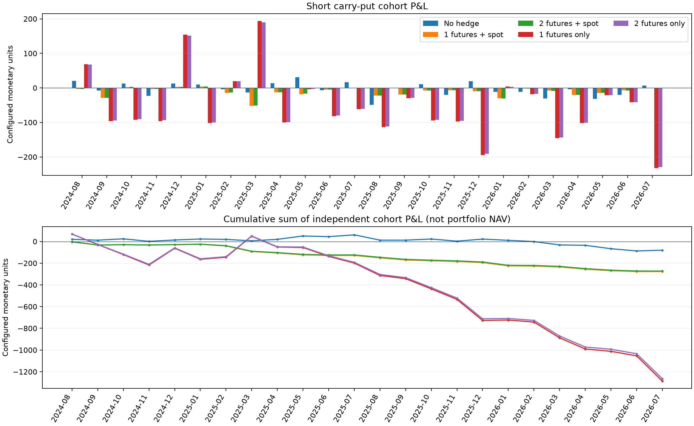
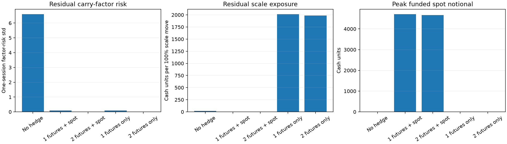

# Short carry-put with funded spot — historical validation

This conditional experiment sells the established carry-put optional component and compares funded spot hedges with futures-only controls. Spot dividends are exactly zero; model carry, theta, and locked inception carry remain unchanged.

The run completed 24 eligible cohorts from 2024-08-19 through 2026-07-20. There were 22 early exercises and 2 expiries; all five scenarios share each cohort's exercise date.

## Baseline results

| Scenario | Sum P&L | Mean P&L | Pooled daily discounted P&L std | Mean cohort daily std |
|---|---:|---:|---:|---:|
| Short no hedge | -80.082507 | -3.336771 | 7.360822 | 7.359468 |
| Short 1 futures + spot | -276.617669 | -11.525736 | 3.911521 | 3.511264 |
| Short 2 futures + spot | -272.485234 | -11.353551 | 3.890142 | 3.455143 |
| Short 1 futures only | -1285.773227 | -53.573884 | 29.311837 | 26.564050 |
| Short 2 futures only | -1263.259184 | -52.635799 | 28.852239 | 26.132022 |

P&L is in configured monetary units (points when both multipliers are 1). Cohort sums are independent trades, not a funded portfolio NAV or annual return.

## Hedge sufficiency

The one-futures-plus-spot scenario neutralizes scale exposure and minimizes the remaining one-dimensional carry-factor variance. The two-futures-plus-spot scenario neutralizes both modeled carry factors and scale. Futures-only controls intentionally retain their scale exposure.

| Scenario | Carry-factor variance reduction | Max |slow| (cash/state) | Max |fast| (cash/state) | Max cash-scale (cash/unit scale) | Max spot delta (spot units) | Peak spot notional | Peak borrowing |
|---|---:|---:|---:|---:|---:|---:|---:|
| Short no hedge | 0.0000% | 389.735267 | 185.578608 | 48.996707 | 0.007275364 | 0.000000 | 48.774371 |
| Short 1 futures + spot | 99.9773% | 83.304645 | 0.311667 | 0.000000 | 0.000000000 | 4713.348224 | 4669.808213 |
| Short 2 futures + spot | 100.0000% | 0.000000 | 0.000000 | 0.000000 | 0.000000000 | 4671.739515 | 4627.937442 |
| Short 1 futures only | 99.9773% | 83.304645 | 0.311667 | 4713.348224 | 0.632909709 | 0.000000 | 232.184361 |
| Short 2 futures only | 100.0000% | 0.000000 | 0.000000 | 4671.739515 | 0.627322480 | 0.000000 | 229.087641 |

## Independent accounting and controls

The independent funded replay's maximum daily equity/cash/position error was 1.364e-12. The short futures-only controls should be compared with the negative legacy long-option results; this is a sign/accounting regression, not a forecast of new spot-hedged performance.

| Variant | Scenario | Sum P&L | Daily P&L std | Costs |
|---|---|---:|---:|---:|
| baseline | Short no hedge | -80.082507 | 7.360822 | 0.000000 |
| baseline | Short 1 futures + spot | -276.617669 | 3.911521 | 0.000000 |
| baseline | Short 2 futures + spot | -272.485234 | 3.890142 | 0.000000 |
| baseline | Short 1 futures only | -1285.773227 | 29.311837 | 0.000000 |
| baseline | Short 2 futures only | -1263.259184 | 28.852239 | 0.000000 |
| lag1 | Short no hedge | -80.082507 | 7.360822 | 0.000000 |
| lag1 | Short 1 futures + spot | -164.857803 | 4.316540 | 0.000000 |
| lag1 | Short 2 futures + spot | -162.173544 | 4.276727 | 0.000000 |
| lag1 | Short 1 futures only | -717.563765 | 28.335790 | 0.000000 |
| lag1 | Short 2 futures only | -702.980590 | 27.877494 | 0.000000 |
| costs | Short no hedge | -80.082507 | 7.360822 | 0.000000 |
| costs | Short 1 futures + spot | -300.483064 | 3.951034 | 23.857908 |
| costs | Short 2 futures + spot | -296.124387 | 3.929505 | 23.631740 |
| costs | Short 1 futures only | -1291.195905 | 29.314400 | 5.420905 |
| costs | Short 2 futures only | -1268.667104 | 28.854810 | 5.406150 |

The baseline uses same-close continuous targets, zero costs, the 1.4% common funding rate, and zero spot dividends. The lag sensitivity delays futures and spot targets together; the costs sensitivity uses 0.2 futures points one-way and 1 bp spot notional. These are illustrative accounting sensitivities.

## Numerical pilot

The planned 2025-07-21 cohort was rerun at 451×601 with 61-point quadrature. These differences are a pilot only; no full fine-grid historical batch was run.

| Scenario | Fine minus baseline premium | Fine minus baseline lifetime P&L | Fine minus baseline daily P&L std |
|---|---:|---:|---:|
| Short no hedge | -0.010825 | -0.010833 | -0.000672 |
| Short 1 futures + spot | -0.010825 | 0.351467 | -0.059776 |
| Short 2 futures + spot | -0.010825 | 0.353215 | -0.059984 |
| Short 1 futures only | -0.010825 | 1.071216 | -0.161865 |
| Short 2 futures only | -0.010825 | 1.078886 | -0.163557 |

The fine pilot kept the same exercise/expiry outcome; the observed P&L differences should limit reported numerical precision.

## Assumptions and limitations

Spot is a hypothetical directly tradable index instrument with zero cash dividends, fully funded through the common cash account. Observed futures carry and this zero-dividend spot convention need not be an arbitrage-consistent market. The results are therefore a conditional hedge/P&L experiment, not an arbitrage or replication claim.

Historical OU dynamics are provisionally treated as risk-neutral. Option marks and premiums are model values, exercise uses observed futures, margin and liquidity are omitted, and no asymmetric financing or option transaction fee is modeled.

## Files

- [Baseline daily ledger](baseline/daily_ledger.csv)
- [Baseline cohort P&L](baseline/cohort_pnl.csv)
- [Exposure summary](exposure_summary.csv)
- [Execution sensitivities](execution_sensitivities.csv)
- [Validation checks](validation_checks.json)
- [Numerical fine pilot](fine/cohort_pnl.csv)
- [Test results](test_results.json)
- [Analysis provenance](analysis_manifest.json)
- [Old/new comparison](old_new_comparison.json)
- [Bug-fix handoff](../short_spot_bugfix_handoff.md)
